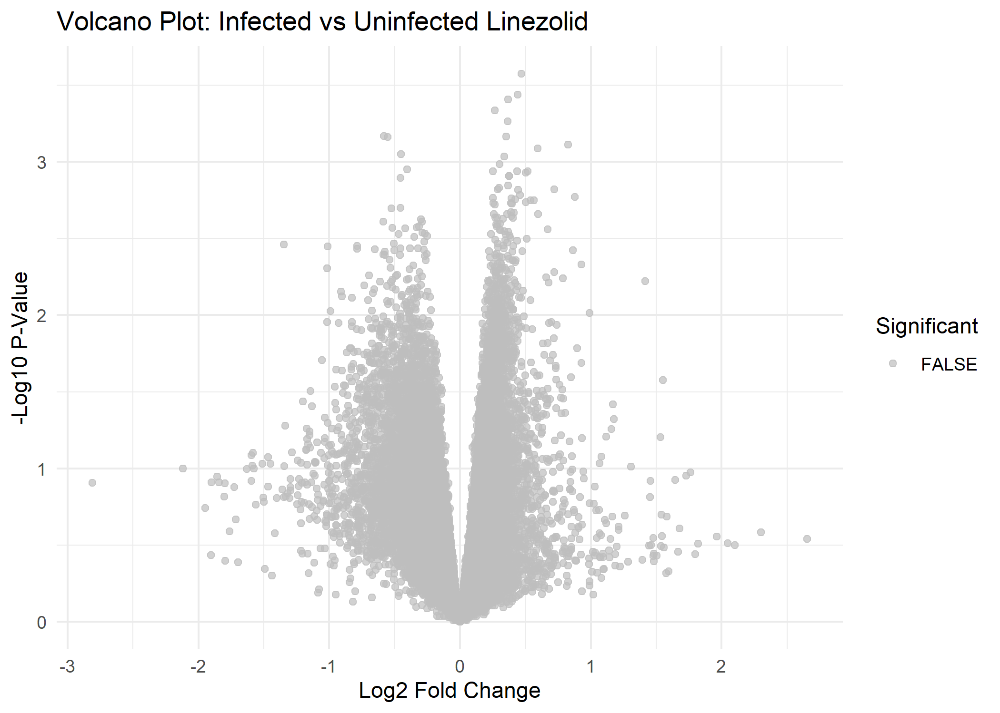
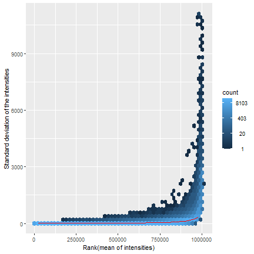

```{r class.source= 'fold-hide' , setup, include=FALSE}
library(knitr)
library(rmdformats)

## Global options
options(max.print="75")
opts_chunk$set(echo=TRUE,
	             cache=FALSE,
               prompt=FALSE,
               tidy=TRUE,
               comment=NA,
               message=FALSE,
               warning=FALSE)
opts_knit$set(width=75)

knitr::opts_chunk$set(message = FALSE, warning = FALSE)

```


```{r directorios}
workingDir <- getwd()
dataDir <- file.path(workingDir, "datos")
resultsDir <- file.path(workingDir, "resultados")

```


```{r paquetes}
if (!require(BiocManager)) install.packages("BiocManager")

installifnot <- function (pkg){
  if (!require(pkg, character.only=T)){
    BiocManager::install(pkg)
  }
}
# BiocManager::install() # Actualiza paquetes instalados
installifnot("pd.mogene.1.0.st.v1")
installifnot("mogene10sttranscriptcluster.db")
installifnot("oligo") #anotaciones de affymetrix
installifnot("limma") #análisis de modelos lineales
installifnot("Biobase") #paquete esencial de bioconductor
installifnot("arrayQualityMetrics") #control de calidad
installifnot("genefilter") #filtrado
installifnot("annotate") #anotaciones
installifnot("xtable")
installifnot("gplots")
installifnot("GOstats")#análisis de significación biológica
installifnot("GEOquery")#acceso y manipulacion de datos de GEO
installifnot("affy") #analisis de datos plataforma affymetrix

```


# Introducción y Objetivos

El estudio investiga cómo los antibióticos linezolid y vancomicina afectan la expresión génica del huésped y la inmunomodulación durante una infección por Staphylococcus aureus resistente a meticilina (MRSA). Utilizando el modelo murino A/J y el aislado USA300 de MRSA, se analizaron diferencias en la producción de toxinas bacterianas, citoquinas del huésped y vías de señalización relacionadas con la infección.

## Diseño del estudio:

35 ratones divididos en siete grupos (sin infección, sin infección con antibióticos, infección con MRSA a las 2 y 24 horas, e infección tratada con linezolid o vancomicina).
Los ratones se infectaron con MRSA y se trataron intravenosamente con linezolid o vancomicina a las 2 horas post-infección (hpi).
Se analizaron CFUs en sangre y riñón, citoquinas en suero (IL-1β, IL-6, TNF-α) y toxinas bacterianas (leucocidina Panton-Valentine y alfa hemolisina) mediante ELISA.


# Métodos

Se usaron 5 muestras de RNA obtenidas de ratones infectados con MRSA y tratados con linezolid o vancomicina. Estas muestras permitieron identificar diferencias en la expresión génica del huésped entre los tratamientos y en comparación con los controles.

Propósito:
El objetivo fue evaluar cómo los tratamientos con linezolid y vancomicina afectan la respuesta génica del huésped en un contexto de sepsis por MRSA, proporcionando datos clave para entender la modulación inmunológica asociada a cada antibiótico.

Etapas a cubrir:
Preparación de los datos

Descargar datos crudos desde GEO.
Eliminar muestras a las 2 horas.
Seleccionar 24 muestras usando la función selectSamples.

Análisis exploratorio y control de calidad

Decidir si los datos requieren transformación.
Visualizar separación de los grupos.
Aplicar control de calidad (usando arrayqualitymetrics).

Filtrado de los datos

Eliminar sondas menos variables (top 10% en variabilidad).
Construcción de matrices de diseño y contrastes

Crear matrices necesarias para las comparaciones especificadas.
Identificación de genes diferencialmente expresados

Usar limma para identificar genes diferencialmente expresados en las tres comparaciones.
Anotación de los genes

Asociar identificadores como Symbol, EntrezID, o EnsemblID.
Análisis de significación biológica

Realizar enriquecimiento funcional y análisis GSEA con clusterProfiler.
Informe del análisis

Generar informe en Rmarkdown (HTML).

## Lectura de datos

```{r targets}

library(Biobase)

targetsDF <- read.csv(file = file.path(dataDir, "targetsDF.csv"), header = TRUE, sep = ";")
# DEFINE SOME VARIABLES FOR PLOTS
sampleNames <- as.character(targetsDF$shortname)
sampleColor <- as.character(targetsDF$colors)
# Creamos un objeto AnnotatedDataFrame
targets <- AnnotatedDataFrame(targetsDF)

```


```{r}

library(GEOquery)
geo_accession <- "GSE38531"
gse <- getGEO(geo_accession, GSEMatrix = TRUE, AnnotGPL = TRUE)


names(gse)
eset <- gse[[1]]

# Información sobre las muestras
pData(eset)

getGEOSuppFiles(geo_accession, makeDirectory = FALSE, baseDir = dataDir)

```

```{r}

# Listar los archivos .tar en el directorio
list_files <- list.files(dataDir, pattern = "\\.tar$", full.names = TRUE)

# Descomprimir cada archivo .tar
for (file in list_files) {
  untar(file, exdir = dataDir) # Extrae los contenidos del .tar en el directorio
}

# Ahora manejar los archivos .CEL.gz extraídos
# Listar archivos .CEL.gz en el directorio después de extraer los .tar
cel_gz_files <- list.files(dataDir, pattern = "\\.CEL\\.gz$", full.names = TRUE)

# Descomprimir cada archivo .CEL.gz
if (length(cel_gz_files) > 0) {
  for (file in cel_gz_files) {
    R.utils::gunzip(file, remove = TRUE) # Elimina el archivo .gz después de descomprimir
  }
}

# Confirmar que los archivos .CEL han sido descomprimidos
list.files(dataDir, pattern = "\\.CEL$", full.names = TRUE)

```


```{r}
# Listar todos los archivos .CEL en el directorio
cel_files <- list.files(dataDir, pattern = "\\.CEL$", full.names = TRUE)

# Renombrar cada archivo manteniendo solo su identificador
for (file in cel_files) {
  # Obtener el nombre base del archivo (sin ruta completa)
  nombrearch <- basename(file)
  
  # Extraer el identificador (el texto antes del primer guion bajo "_")
  identificador <- sub("^(GSM[0-9]+)_.*", "\\1", nombrearch)
  
  # Crear la nueva ruta con el nombre renombrado
  nuevoarchivo <- file.path(dirname(file), paste0(identificador, ".CEL"))
  
  # Renombrar el archivo
  file.rename(file, nuevoarchivo)
}

# Verificar los archivos renombrados
list.files(dataDir, pattern = "\\.CEL$", full.names = TRUE)
```


```{r}
library(oligo)

CELfiles <- paste0(targetsDF$muestra, ".CEL")
rawData <- read.celfiles(file.path(dataDir, CELfiles), phenoData = targets)

```


```{r}
filter_microarray <- function(allTargets, seed = 43141876) {
  # Configurar la semilla aleatoria
  set.seed(seed)
  
  # Filtrar las filas donde 'hora' no sea 'T2'
  filtered <- subset(allTargets, hora != "hour 2", select = colnames(allTargets))
  
  # Dividir el dataset por grupos únicos de 'infeccion' + 'tratamiento'
  filtered$group <- interaction(filtered$infeccion, filtered$tratamiento)
  
  # Seleccionar 4 muestras al azar de cada grupo
  selected <- do.call(rbind, lapply(split(filtered, filtered$group), function(group_data) {
    if (nrow(group_data) > 4) {
      group_data[sample(1:nrow(group_data), 4), ]
    } else {
      group_data
    }
  }))
  
  # Obtener los índices originales como nombres de las filas seleccionadas
  original_indices <- match(selected$muestra, allTargets$muestra)
  
  # Modificar los rownames usando 'muestra' y los índices originales
  rownames(selected) <- paste0(selected$muestra, ".", original_indices)
  
  # Eliminar la columna 'group' y devolver el resultado
  selected$group <- NULL
  return(selected)
}

```


```{r}
allTargets <- data.frame(
  muestra = c("GSM944831", "GSM944838", "GSM944845", "GSM944852", "GSM944859",
             "GSM944833", "GSM944840", "GSM944847", "GSM944854", "GSM944861",
             "GSM944834", "GSM944841", "GSM944848", "GSM944855", "GSM944862",
             "GSM944832", "GSM944839", "GSM944846", "GSM944853", "GSM944860",
             "GSM944835", "GSM944842", "GSM944849", "GSM944856", "GSM944863",
             "GSM944836", "GSM944843", "GSM944850", "GSM944857", "GSM944864",
             "GSM944837", "GSM944844", "GSM944851", "GSM944858", "GSM944865"),
  infeccion = c(rep("uninfected", 15), rep("S. aureus USA300", 20)),
  hora = c(rep("hour 0", 15), rep("hour 2", 5), rep("hour 24", 15)),
  tratamiento = c(rep("untreated", 5), rep("linezolid", 5), rep("vancomycin", 5),
            rep("untreated", 5), rep("untreated", 5), rep("linezolid", 5), rep("vancomycin", 5))
)

# Aplicar la función (cambiar 123 por vuestro ID de la UOC u otro número que podáis escribir en el documento)
result <- filter_microarray(allTargets, seed=43141876)

```

```{r}
cel_files <- list.files(dataDir, pattern = "\\.CEL$", full.names = TRUE)

# Asegurar que los nombres seleccionados coincidan exactamente con los archivos en cel_files
selected_samples <- result$muestra
selected_cel_files <- cel_files[basename(cel_files) %in% paste0(selected_samples, ".CEL")]


```


## Exploración y control de calidad

```{r}
library(affy)
CELfiles <- basename(selected_cel_files)  # Extraer solo los nombres base
targets <- result  # Usar el dataframe de muestras seleccionadas como phenoData

# Crear un objeto AnnotatedDataFrame para el phenoData
annotatedTargets <- AnnotatedDataFrame(data = targets)

# Leer los archivos .CEL y generar un ExpressionFeatureSet
raw_data <- read.celfiles(filenames = file.path(dataDir, CELfiles), phenoData = annotatedTargets)

# Inspeccionar el objeto ExpressionFeatureSet
print(raw_data)

```

### Funciones ad-hoc


```{r}
# Crear un boxplot para las intensidades crudas

# Crear un vector de colores según el tratamiento
# Cambiar "result$tratamiento" al nombre correcto de la columna si es necesario
colores <- ifelse(result$tratamiento == "untreated", "red",
           ifelse(result$tratamiento == "vancomycin", "blue", "green"))

# Verificar los colores asignados
print(colores)

# Generar el boxplot con colores
boxplot(raw_data, las = 2, main = "Distribución de intensidades crudas", col = colores)

# Agregar una leyenda para los colores
legend("topright", legend = c("Untreated", "Vancomycin", "Linezolid"),
       fill = c("red", "blue", "green"), bty = "n")

boxplot(raw_data, las = 2, main = "Distribución de intensidades crudas")

```

Clusterin Jerarquico


```{r}
# Crear un vector con las etiquetas concatenadas
labels <- paste(result$infeccion, result$hora, result$tratamiento, sep = " | ")

# Calcular la distancia euclidiana y realizar el clustering jerárquico
clust.euclid.average <- hclust(dist(t(exprs(raw_data))), method = "average")

# Crear el dendrograma con las etiquetas concatenadas
plot(clust.euclid.average, labels = labels, 
     main = "Clustering jerárquico de datos crudos", 
     cex = 0.7, hang = -1)

```


PCA

```{r}
plotPCA <- function(X, labels = NULL, colors = NULL, dataDesc = "", scale = FALSE,
                     formapunts = NULL, myCex = 0.8, ...) {
    # Análisis PCA
    pcX <- prcomp(t(X), scale = scale)  # Transposición necesaria para PCA
    loads <- round(pcX$sdev^2 / sum(pcX$sdev^2) * 100, 1)  # Cálculo de varianza explicada
    xlab <- paste("PC1 (", loads[1], "%)", sep = "")
    ylab <- paste("PC2 (", loads[2], "%)", sep = "")
    
    # Asignar colores por defecto si no se proporcionan
    if (is.null(colors)) colors <- 1
    
    # Graficar PCA
    plot(pcX$x[, 1:2], xlab = xlab, ylab = ylab, col = colors, pch = formapunts, 
         main = paste("PCA -", dataDesc), cex = myCex, ...)
    text(pcX$x[, 1], pcX$x[, 2], labels, pos = 3, cex = myCex)
}

```


```{r}
# Asignar etiquetas (nombres de las muestras) y colores según el tratamiento
labels <- result$muestra
colors <- ifelse(result$tratamiento == "untreated", "red", 
                 ifelse(result$tratamiento == "vancomycin", "blue", "green"))

# Graficar PCA para los datos crudos
plotPCA(exprs(raw_data), labels = labels, colors = colors, 
        dataDesc = "Raw Data", formapunts = 16, myCex = 0.8)
```


### QC con arrayQalityMetrics

```{r}
library(arrayQualityMetrics)

rerun <- FALSE
if (rerun) {
    arrayQualityMetrics(expressionset = rawData, reporttitle = resultsDir, force = TRUE)
}

```




Para algunos de los gráficos obtenidos con Array Quality Metrix, se observa sobre todo en sin tratamiento que están subexpresadas,además en la parte baja Esto indica que los cambios observados (la subexpresión) no son considerados estadísticamente relevantes según el umbral. asi pues Los puntos en esa región representan características que están subexpresadas, pero no tienen suficiente evidencia estadística para ser consideradas diferencialmente expresadas con confianza. Estas observaciones podrían ser ruido experimental o requerir más muestras para confirmar su significancia.

## Normalización

Datos Normalizados

```{r}
if (!requireNamespace("affy", quietly = TRUE)) {
  install.packages("affy")
}

if (!requireNamespace("BiocManager", quietly = TRUE)) {
  install.packages("BiocManager")
}
BiocManager::install("affy")

library(affy)

# Leer los archivos .CEL con affy
raw_data_affy <- ReadAffy(filenames = selected_cel_files)

# Normalización con RMA
normalized_data <- affy::rma(raw_data_affy)

# Transferir el phenoData del objeto original al objeto normalizado
pData(normalized_data) <- pData(raw_data)

# Verificar que el phenoData se haya transferido correctamente
print(pData(normalized_data))

expr_matrix <- exprs(normalized_data)


```


```{r}
# Crear colores para cada muestra según el tratamiento
colores <- ifelse(result$tratamiento == "untreated", "red",
           ifelse(result$tratamiento == "vancomycin", "blue", "green"))

# Boxplot de intensidades normalizadas
boxplot(expr_matrix, las = 2, col = colores, 
        main = "Distribución de intensidades normalizadas",
        xlab = "Muestras", ylab = "Intensidades Normalizadas")
```

```{r}
# Clustering jerárquico con datos normalizados
library(stats)

labels2 <- paste(pData(normalized_data)$infeccion, 
                pData(normalized_data)$tratamiento, 
                sep = " - ")

clust_norm <- hclust(dist(t(expr_matrix)), method = "average")

# Graficar el dendrograma
plot(clust_norm, labels = labels2,
     main = "Clustering jerárquico de datos normalizados", 
     cex = 0.7, hang = -1)
```

```{r}
# PCA de las intensidades normalizadas
library(ggplot2)

# Realizar el PCA
pca <- prcomp(t(expr_matrix))

# Crear un dataframe para el PCA
pca_data <- as.data.frame(pca$x)
pca_data$tratamiento <- result$tratamiento
pca_data$hora <- result$hora

# Graficar PCA
ggplot(pca_data, aes(x = PC1, y = PC2, color = tratamiento, shape = hora)) +
  geom_point(size = 4) +
  theme_minimal() +
  labs(title = "PCA de intensidades normalizadas", 
       x = paste("PC1 (", round(summary(pca)$importance[2, 1] * 100, 1), "%)", sep = ""),
       y = paste("PC2 (", round(summary(pca)$importance[2, 2] * 100, 1), "%)", sep = ""))
```
Las dos primeras componentes explican casi un 60% de la variabilidad en los grupos, pero no se puede afirmar diferencias en los grupos ni por infectado=24h, no infectado=0h, ni por tratamiento.

## Filtrado

```{r}
library(genefilter)

topVarGenes <- varFilter(exprs(normalized_data), var.cutoff = 0.9)
filteredEset <- normalized_data[topVarGenes, ]

```

```{r}

if (!requireNamespace("BiocManager", quietly = TRUE))
    install.packages("BiocManager")
BiocManager::install("mouse4302.db")

library(mouse4302.db)

annotation(normalized_data) <- "mouse4302.db"
```


```{r}
# Filtrar las sondas

filtered_data <- nsFilter(normalized_data, 
                          var.func = IQR, 
                          var.cutoff = 0.7, 
                          var.filter = TRUE, 
                          require.entrez = TRUE, 
                          filterByQuantile = TRUE)

# Inspeccionar el objeto filtrado
filtered_data

```
numDupsRemoved: 16,958 sondas duplicadas eliminadas.
numLowVar: 14,336 sondas de baja varianza eliminadas.
numRemoved.ENTREZID: 7,650 sondas eliminadas por no tener un ENTREZID.
feature.exclude: 13 sondas eliminadas por otros criterios.

```{r}
# Dimensiones antes y después del filtrado
dim(normalized_data)         # Antes del filtrado
dim(filtered_data$eset)      # Después del filtrado

# Número de genes eliminados
cat("Número de genes eliminados:", dim(normalized_data)[1] - dim(filtered_data$eset)[1], "\n")

```

```{r}
filteredEset <- filtered_data$eset
filteredData <- exprs(filteredEset)
colnames(filteredData) <- pData(filtered_data$eset)$tratamiento
```


## Selección de genes

```{r}
library(limma)

# Extraer phenoData del objeto ExpressionSet normalizado
pheno_data <- pData(normalized_data)

# Definir los grupos basados en infeccion y tratamiento
treat <- interaction(pheno_data$infeccion, pheno_data$tratamiento, drop = TRUE)

# Crear niveles como factores
lev <- factor(treat, levels = unique(treat))

# Construir la matriz de diseño
design <- model.matrix(~0 + lev)
colnames(design) <- levels(lev)
rownames(design) <- rownames(pheno_data)

# Imprimir la matriz de diseño para verificar
print(design)


```

```{r}
# Convertir los nombres de los niveles en nombres válidos
colnames(design) <- make.names(colnames(design))

# Crear la matriz de contrastes con los nombres ajustados
contrasts <- makeContrasts(
  Infected_vs_Uninfected_Untreated = `S..aureus.USA300.untreated` - `uninfected.untreated`,
  Infected_vs_Uninfected_Vancomycin = `S..aureus.USA300.vancomycin` - `uninfected.vancomycin`,
  Infected_vs_Uninfected_Linezolid = `S..aureus.USA300.linezolid` - `uninfected.linezolid`,
  levels = colnames(design)
)

# Imprimir la matriz de contrastes para verificar
print(contrasts)


```

```{r}
# Ajustar el modelo lineal con limma
fit <- lmFit(normalized_data, design)

# Aplicar los contrastes al modelo
fit2 <- contrasts.fit(fit, contrasts)

# Realizar el análisis Bayesiano
fit2 <- eBayes(fit2)

# Ver los resultados para cada contraste
results_untreated <- topTable(fit2, coef = "Infected_vs_Uninfected_Untreated", number = 10)
results_vancomycin <- topTable(fit2, coef = "Infected_vs_Uninfected_Vancomycin", number = 10)
results_linezolid <- topTable(fit2, coef = "Infected_vs_Uninfected_Linezolid", number = 10)

# Imprimir los resultados para el contraste sin tratamiento
print(results_untreated)

```
logFC: Los genes con valores extremos (positivos o negativos) son los más interesantes para interpretación biológica.
P.Value vs adj.P.Val: Aunque los valores p son bajos, los valores ajustados son altos (0.999589), lo que indica que no hay genes significativos tras el ajuste.
B: Todos los valores de B son negativos, lo que sugiere una baja confianza en que estos genes sean diferencialmente expresados.


```{r}
write.csv(results_untreated, file = file.path(resultsDir, "Infected_vs_Uninfected_Untreated.csv"))
write.csv(results_vancomycin, file = file.path(resultsDir, "Infected_vs_Uninfected_Vancomycin.csv"))
write.csv(results_linezolid, file = file.path(resultsDir, "Infected_vs_Uninfected_Linezolid.csv"))

```


```{r}
library(ggplot2)
volcano_data <- data.frame(
  logFC = fit2$coefficients[, "Infected_vs_Uninfected_Untreated"],
  P.Value = fit2$p.value[, "Infected_vs_Uninfected_Untreated"]
)
ggplot(volcano_data, aes(x = logFC, y = -log10(P.Value))) +
  geom_point() +
  xlab("log2 Fold Change") + ylab("-log10(P.Value)") +
  ggtitle("Volcano Plot") +
  theme_minimal()

```

```{r}
library(mouse4302.db)

# Verifica si los PROBEID están presentes en el paquete de anotación
probe_check <- AnnotationDbi::select(
  mouse4302.db,
  keys = head(rownames(fit2$coefficients)),  # Probar con las primeras sondas
  columns = c("ENTREZID", "SYMBOL"),
  keytype = "PROBEID"
)

# Mostrar las anotaciones encontradas
print(probe_check)
```


```{r}
# Generar resultados con topTable
results_untreated <- topTable(
  fit2,
  coef = "Infected_vs_Uninfected_Untreated",
  number = nrow(fit2),
  adjust = "fdr",
  lfc = 3,
  p.value = 0.05
)


```


```{r}
results_vancomycin <- topTable(
  fit2,
  coef = "Infected_vs_Uninfected_Vancomycin",
  number = nrow(fit2),
  adjust = "fdr",
  lfc = 3,
  p.value = 0.05
)

results_linezolid <- topTable(
  fit2,
  coef = "Infected_vs_Uninfected_Linezolid",
  number = nrow(fit2),
  adjust = "fdr",
  lfc = 3,
  p.value = 0.05
)

```

```{r}
write.csv(results_untreated, file = file.path(resultsDir, "Filtered_Untreated.csv"))
write.csv(results_vancomycin, file = file.path(resultsDir, "Filtered_Vancomycin.csv"))
write.csv(results_linezolid, file = file.path(resultsDir, "Filtered_Linezolid.csv"))

```


```{r}
library(ggplot2)

# Crear un dataframe para el volcano plot
volcano_data_untreated <- data.frame(
  logFC = fit2$coefficients[, "Infected_vs_Uninfected_Untreated"],
  P.Value = fit2$p.value[, "Infected_vs_Uninfected_Untreated"],
  adj.P.Val = p.adjust(fit2$p.value[, "Infected_vs_Uninfected_Untreated"], method = "fdr")
)

# Agregar columna de genes significativos
volcano_data_untreated$Significant <- with(volcano_data_untreated,
  abs(logFC) > 3 & adj.P.Val < 0.05
)

# Crear el volcano plot
ggplot(volcano_data_untreated, aes(x = logFC, y = -log10(P.Value), color = Significant)) +
  geom_point(alpha = 0.7, size = 1.5) +
  scale_color_manual(values = c("grey", "red")) +
  xlab("Log2 Fold Change") +
  ylab("-Log10 P-Value") +
  ggtitle("Volcano Plot: Infected vs Uninfected Untreated") +
  theme_minimal()

```


```{r}
# Para Vancomycin
volcano_data_vancomycin <- data.frame(
  logFC = fit2$coefficients[, "Infected_vs_Uninfected_Vancomycin"],
  P.Value = fit2$p.value[, "Infected_vs_Uninfected_Vancomycin"],
  adj.P.Val = p.adjust(fit2$p.value[, "Infected_vs_Uninfected_Vancomycin"], method = "fdr")
)

volcano_data_vancomycin$Significant <- with(volcano_data_vancomycin,
  abs(logFC) > 3 & adj.P.Val < 0.05
)

ggplot(volcano_data_vancomycin, aes(x = logFC, y = -log10(P.Value), color = Significant)) +
  geom_point(alpha = 0.7, size = 1.5) +
  scale_color_manual(values = c("grey", "blue")) +
  xlab("Log2 Fold Change") +
  ylab("-Log10 P-Value") +
  ggtitle("Volcano Plot: Infected vs Uninfected Vancomycin") +
  theme_minimal()

```


```{r}
# Para Linezolid
volcano_data_linezolid <- data.frame(
  logFC = fit2$coefficients[, "Infected_vs_Uninfected_Linezolid"],
  P.Value = fit2$p.value[, "Infected_vs_Uninfected_Linezolid"],
  adj.P.Val = p.adjust(fit2$p.value[, "Infected_vs_Uninfected_Linezolid"], method = "fdr")
)

volcano_data_linezolid$Significant <- with(volcano_data_linezolid,
  abs(logFC) > 3 & adj.P.Val < 0.05
)

ggplot(volcano_data_linezolid, aes(x = logFC, y = -log10(P.Value), color = Significant)) +
  geom_point(alpha = 0.7, size = 1.5) +
  scale_color_manual(values = c("grey", "green")) +
  xlab("Log2 Fold Change") +
  ylab("-Log10 P-Value") +
  ggtitle("Volcano Plot: Infected vs Uninfected Linezolid") +
  theme_minimal()

```


```{r}
ggsave("Volcano_Untreated.png", plot = last_plot(), path = resultsDir)
ggsave("Volcano_Vancomycin.png", plot = last_plot(), path = resultsDir)
ggsave("Volcano_Linezolid.png", plot = last_plot(), path = resultsDir)

```


# Resultados


## Anotación de resultados

```{r}
keytypes(mouse4302.db)

# Seleccionar las anotaciones para los probesets en los resultados
anotaciones <- AnnotationDbi::select(
  mouse4302.db,
  keys = rownames(results_untreated),  # Probesets de los resultados
  columns = c("ENTREZID", "SYMBOL"),
  keytype = "PROBEID"  # Usamos los probesets como clave
)

# Inspeccionar las anotaciones extraídas
head(anotaciones)


```

## Visualización de resultados

### Volcano-plot
```{r}
# Extraer los nombres de los genes (SYMBOL) para los probesets
genenames <- AnnotationDbi::select(
  mouse4302.db,
  keys = rownames(results_untreated),
  columns = c("SYMBOL"),
  keytype = "PROBEID"
)$SYMBOL

```


```{r}
library(limma)

# Volcano plot para los datos del contraste untreated
volcanoplot(
  fit2, 
  coef = "Infected_vs_Uninfected_Untreated",  # Contraste específico
  highlight = 10,                            # Número de genes destacados
  names = genenames,                         # Nombres de los genes
  main = "Volcano Plot: Infected vs Uninfected Untreated"
)

# Añadir líneas de referencia para logFC de ±3
abline(v = c(-3, 3), col = "red", lty = 2)

```


```{r}
# Guardar el volcano plot como archivo PNG
png(file = file.path(resultsDir, "Volcano_Plot_Untreated.png"), width = 800, height = 600)
volcanoplot(
  fit2, 
  coef = "Infected_vs_Uninfected_Untreated", 
  highlight = 10, 
  names = genenames, 
  main = "Volcano Plot: Infected vs Uninfected Untreated"
)
abline(v = c(-3, 3), col = "red", lty = 2)
dev.off()


```


```{r}
# Para Vancomicina
volcanoplot(
  fit2, 
  coef = "Infected_vs_Uninfected_Vancomycin", 
  highlight = 10, 
  names = genenames, 
  main = "Volcano Plot: Infected vs Uninfected Vancomycin"
)
abline(v = c(-3, 3), col = "red", lty = 2)

# Para Linezolid
volcanoplot(
  fit2, 
  coef = "Infected_vs_Uninfected_Linezolid", 
  highlight = 10, 
  names = genenames, 
  main = "Volcano Plot: Infected vs Uninfected Linezolid"
)
abline(v = c(-3, 3), col = "red", lty = 2)

# Guardar volcano plot para vancomicina
png(file = file.path(resultsDir, "Volcano_Plot_Vancomycin.png"), width = 800, height = 600)
volcanoplot(
  fit2, 
  coef = "Infected_vs_Uninfected_Vancomycin", 
  highlight = 10, 
  names = genenames, 
  main = "Volcano Plot: Infected vs Uninfected Vancomycin"
)
abline(v = c(-3, 3), col = "red", lty = 2)
dev.off()

# Guardar volcano plot para linezolid
png(file = file.path(resultsDir, "Volcano_Plot_Linezolid.png"), width = 800, height = 600)
volcanoplot(
  fit2, 
  coef = "Infected_vs_Uninfected_Linezolid", 
  highlight = 10, 
  names = genenames, 
  main = "Volcano Plot: Infected vs Uninfected Linezolid"
)
abline(v = c(-3, 3), col = "red", lty = 2)
dev.off()


```


## Analisis de significación biologica

```{r significacion biologica}
#código adaptado del ejercicio de prácticas
# Cargar las bibliotecas necesarias
library(mouse4302.db)  # Base de datos específica para Affymetrix Mouse Genome 430 2.0
library(GOstats)

# Preparar el universo de genes
probesUniverse <- rownames(filteredData)  # Todas las sondas en el análisis
entrezUniverse <- AnnotationDbi::select(mouse4302.db, probesUniverse, "ENTREZID")$ENTREZID
                                        
# Preparar la lista de genes seleccionados
topProbes <- rownames(filteredEset)  # Sondas seleccionadas como diferencialmente expresadas
entrezTop <- AnnotationDbi::select(mouse4302.db, topProbes, "ENTREZID")$ENTREZID

topGenes <- entrezTop[!duplicated(entrezTop)]
entrezUniverse <- entrezUniverse[!duplicated(entrezUniverse)]


# Crear el objeto GOHyperGParams
GOparams <- new("GOHyperGParams",
                geneIds = topGenes, universeGeneIds = entrezUniverse, annotation = "mouse4302.db",
                ontology = "BP",  # Biological Process (puede ser 'BP', 'MF', o 'CC')
                pvalueCutoff = 0.01)  # Umbral de significación

# Ejecutar el análisis de sobre-representación
GOhyper <- hyperGTest(GOparams)

# Resumen de los resultados
head(summary(GOhyper))
dim(summary(GOhyper))

# Guardar los resultados como un archivo HTML
GOfilename <- file.path(resultsDir, "GOResults.html")
htmlReport(GOhyper, file = GOfilename, summary.args = list(htmlLinks = TRUE))

```


# Discusión


# Referencias

https://www.ncbi.nlm.nih.gov/geo/query/acc.cgi?acc=GSE38531

https://www.ncbi.nlm.nih.gov/geo/query/acc.cgi?acc=GPL1261

https://pmc.ncbi.nlm.nih.gov/articles/PMC3614971/

https://github.com/GilCaraballo/PEC2_Datos_Omicos


# Apendices

